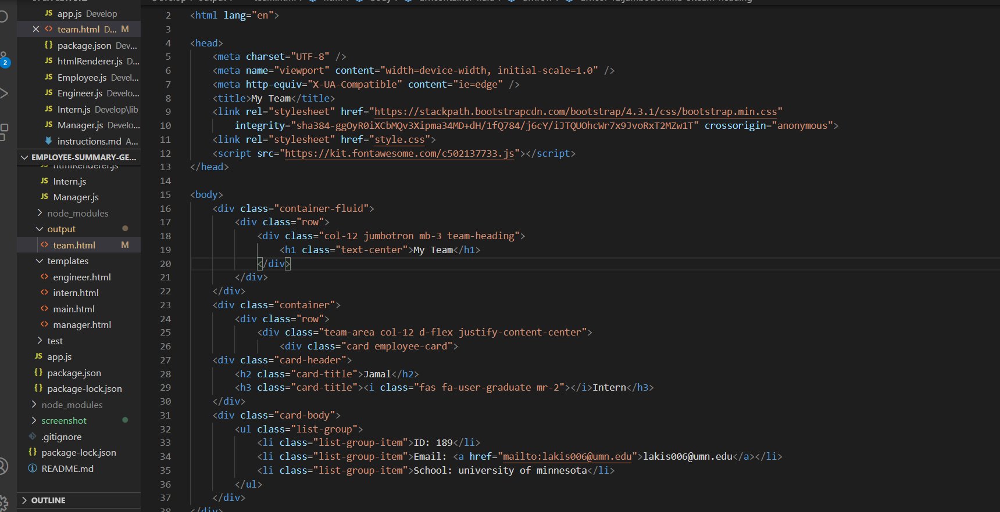
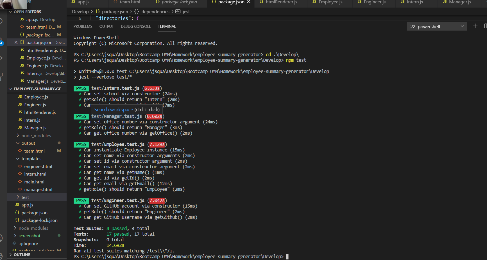

# Employee Summary Generator

## Description

This app builds a software engineering team generator command line application. The application will prompt the user for information about the team manager and then information about the team members. The user can input any number of team members, and they may be a mix of engineers and interns. This assignment must also pass all unit tests. When the user has completed building the team, the application will create an HTML file that displays a nicely formatted team roster based on the information provided by the user. 

## Utilization Video

  

  ## Link to deployed app 
    https://lakis006.github.io/employee-summary-generator/

 ## Screenshot Team.html
   

## Screenshot Test Passed
    

